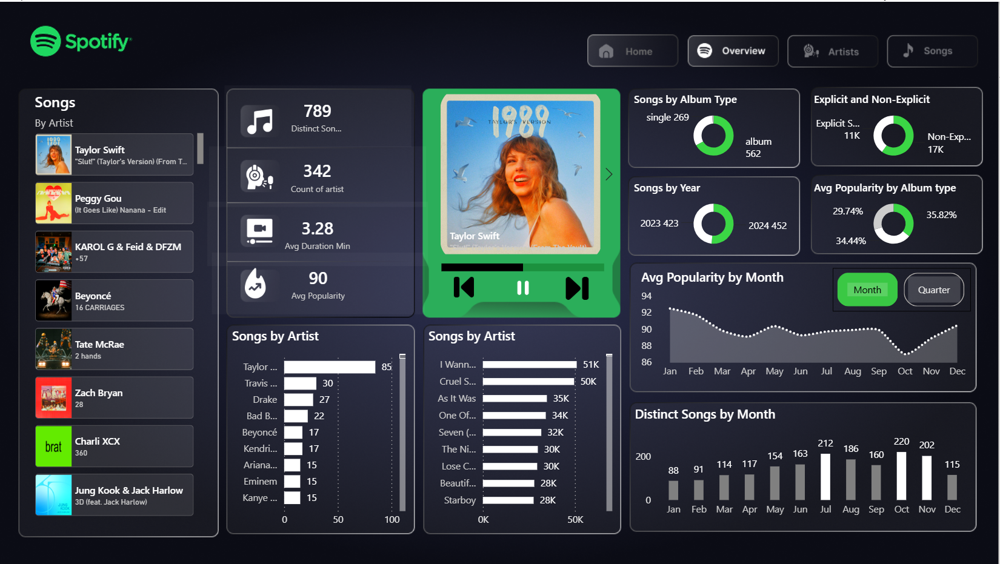

# Spotify Analytics Power BI Dashboard

An interactive **Power BI dashboard** built to analyze Spotify Top 50 music trends, artist performance, song popularity, album types, explicit content, and changes in listening trends over time.



## Project Overview

This project uses a Spotify Top 50 dataset containing **27,800 chart records** from **2023–2024**.

The dashboard provides an interactive overview of song and artist performance while allowing users to explore changes in popularity, album types, release trends, and monthly activity.

The report includes dedicated pages for:

* Overview
* Artists
* Songs

## Dashboard Insights

### Spotify Overview

Key metrics displayed include:

* **789 distinct songs**
* **342 artists**
* Average song duration of approximately **3.28 minutes**
* Song popularity and ranking information

### Artist Analysis

The dashboard compares the number of charting songs across artists, allowing users to identify artists with the strongest presence in the dataset.

The dashboard also includes an interactive song and artist selector with album artwork.

### Album Analysis

Songs are analyzed by album type, including:

* Albums
* Singles

The dashboard compares both the **number of songs** and **average popularity** across album types.

### Explicit Content

Songs are categorized as:

* Explicit
* Non-explicit

This allows the distribution of explicit content within the Spotify Top 50 to be compared.

### Time-Based Trends

The dashboard analyzes:

* Songs by year
* Average popularity by month
* Average popularity by quarter
* Distinct songs appearing each month

These visualizations help identify changes in Spotify chart activity and popularity throughout the year.

## Dataset

The source dataset contains **27,800 records and 11 attributes**:

* Date
* Chart position
* Song
* Artist
* Popularity
* Duration
* Album type
* Total tracks
* Release date
* Explicit status
* Album cover URL

The dataset covers Spotify Top 50 chart data from **May 2023 to November 2024**.

## Power BI Features Used

* Interactive report pages
* KPI cards
* Slicers and filtering
* Page navigation
* Dynamic song and artist selection
* Album artwork using image URLs
* Donut charts
* Bar charts
* Line charts
* Time-series analysis
* Monthly and quarterly comparisons
* Custom dashboard formatting and Spotify-inspired design

## Project Files

```text
Spotify-Analytics-Power-BI-Dashboard/
│
├── README.md
├── Spotify-Dashboard.pbix
│
├── data/
│   └── spotify-top-50-world.xlsx
│
└── images/
    └── dashboard-preview.png
```

### `Spotify-Dashboard.pbix`

Power BI report containing the interactive Spotify analytics dashboard and visualizations.

### `spotify-top-50-world.xlsx`

Source dataset containing Spotify Top 50 chart information used to build the Power BI report.

## Tools Used

* **Microsoft Power BI** — Data modeling, analysis, and dashboard development
* **Microsoft Excel** — Source dataset

## How to View

Download `Spotify-Dashboard.pbix` and open it using **Microsoft Power BI Desktop**.

## Note

This project was created for data analytics, data visualization, and portfolio purposes.
